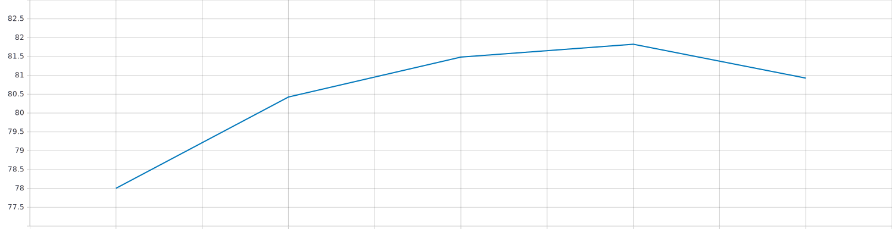

# Huggingface Albert
hugginface albert model and its tokenizer <br>
The albert repo transfer weights from tf-hub module and can run `examples/run_squad_albert.py` to reproduce author's performance. <br>
support for albert_base, albert_large, albert_xlarge <br>

---

### First, prepare your data 
{Training data path} and {Testing data path}.  <br>
### Current status
you can run the squad task for albert <br>

---


### example
```
python run_squad_albert.py --train_file {Training data path} \
--predict_file {Testing data path}  \
--model_type albert \ 
--output_dir ./example_do_lowercase_lamb \
--do_train --do_eval \ 
--overwrite_output_dir --do_lower_case \ 
--evaluate_during_training --warmup_steps 384  \ 
--save_steps 1000 --logging_steps 1000 --num_train_epochs 3 \
```

if you want albert_large or albert_xlarge, you need to download the pytorch_state_dict on here https://drive.google.com/drive/folders/1OZuoBw0cNkPLFXdoz4xTZrTXdRHO7hUI?usp=sharing <br> put on ```examples/pytorch_model_state_dict``` <br>set new a argument below as ```--model_dict_pretrain ./pytorch_model_state_dict/{model_file name}```.<br> adjust the config file set to ```--config_pretrain ./config/{alber_xxx.json}``` then you can use it for big model.

### The Model Performance
#### Version 1

Run on Squad 1.1 task (albert base) <br>
EM 78.89 , F1 score 87.38 

The paper report the performance is below: <br>
EM 82.3 F1 score 89.3

xlarge paper report the performance is below Squad 1.1 <br>
EM 86.1 F1 score 92.6 

My performance for xlarge  <br>
EM 84.52 F1 Score 91.61

#### Version 2 

My Albert_xl2 on squad 1.1 the performance <br>
EM 86.32 F1 Score 92.99 still training.......for 3 epoch !!!!!!

The paper report the version 2 for albert xlarge on Squad 1.1 is 
<br> EM 86.1 F1 Score 92.5 


### Performance On version 2 albert base (Squad 1.1)
Exact Match: <br>


F1 Score: <br>
